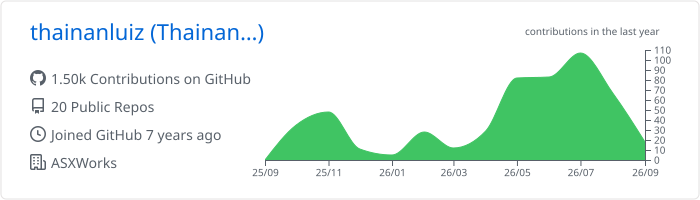
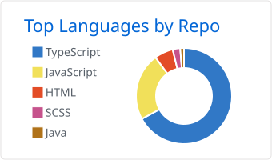
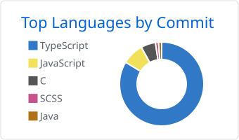
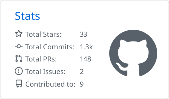
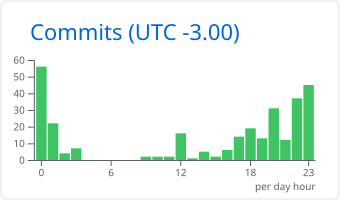

<h1 align="center">Olá, eu sou o Thainan 👋</h1>

  <b>Engenheiro de Software Full Stack</b> · Node.js · TypeScript · React

  
  

  
  
  
  

---

## 🗂️ Minhas Contas no GitHub

Mantenho contas separadas para projetos pessoais e de trabalho. As três são minhas:

| Conta | Tipo |
| :--- | :--- |
| **[@thainanluiz](https://github.com/thainanluiz)** ⬅️ *você está aqui* | Pessoal — open source, estudos e projetos paralelos |
| **[@ThainanWeesu](https://github.com/ThainanWeesu)** | Conta de trabalho |
| **[@thainanluiz1](https://github.com/thainanluiz1)** | Conta de trabalho |

> A maior parte dos meus commits está em repositórios privados distribuídos entre as contas acima.

---

## 💻 Stack de Tecnologias

### Linguagens
   

### Backend
  

### Frontend & Mobile
     

### Arquitetura & APIs
    

### Bancos de Dados & Dados
      

### ORM & Validação
   

### Testes
 

### Mensageria & Assíncrono
 

### Cloud & DevOps
       

### Gerenciadores de Pacotes & Runtimes
   

### Desenvolvimento Assistido por IA

### Integrações & Domínios
  

### Clientes de API
 

### Estilização
     

### Ferramentas & Workflow
      

---

## 📊 Estatísticas do GitHub

  <picture>
    <source media="(prefers-color-scheme: dark)" srcset="./profile-summary-card-output/github_dark/0-profile-details.svg">
    
  </picture>

  <picture>
    <source media="(prefers-color-scheme: dark)" srcset="./profile-summary-card-output/github_dark/1-repos-per-language.svg">
    
  </picture>
  <picture>
    <source media="(prefers-color-scheme: dark)" srcset="./profile-summary-card-output/github_dark/2-most-commit-language.svg">
    
  </picture>

  <picture>
    <source media="(prefers-color-scheme: dark)" srcset="./profile-summary-card-output/github_dark/3-stats.svg">
    
  </picture>
  <picture>
    <source media="(prefers-color-scheme: dark)" srcset="./profile-summary-card-output/github_dark/4-productive-time.svg">
    
  </picture>

## 🐍 Cobrinha de Contribuições

  <picture>
    <source media="(prefers-color-scheme: dark)" srcset="https://raw.githubusercontent.com/thainanluiz/thainanluiz/output/github-contribution-grid-snake-dark.svg">
    <source media="(prefers-color-scheme: light)" srcset="https://raw.githubusercontent.com/thainanluiz/thainanluiz/output/github-contribution-grid-snake.svg">
    
  </picture>

